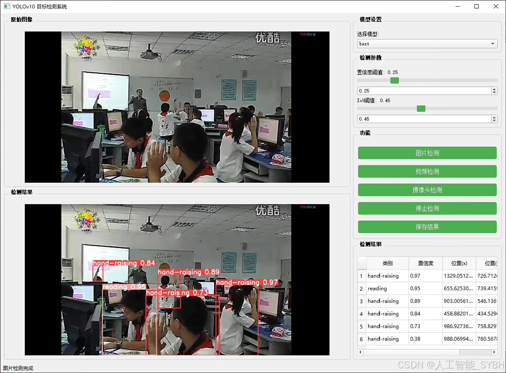
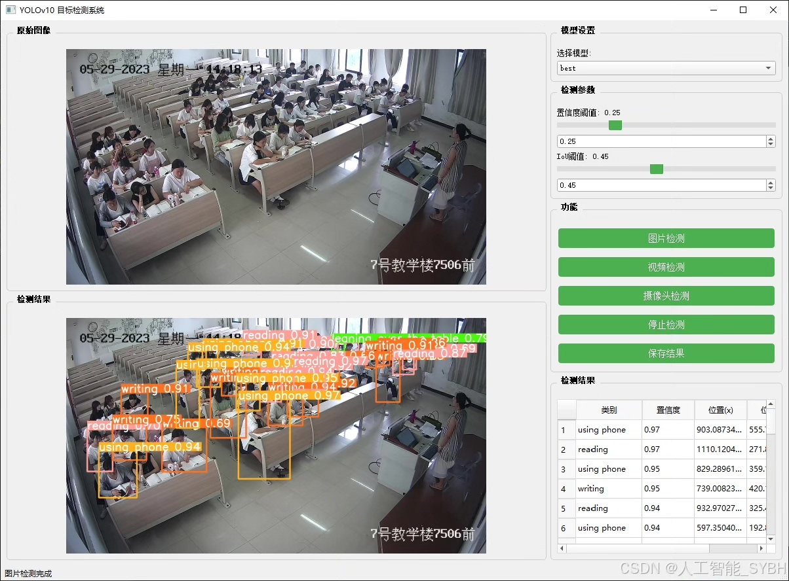
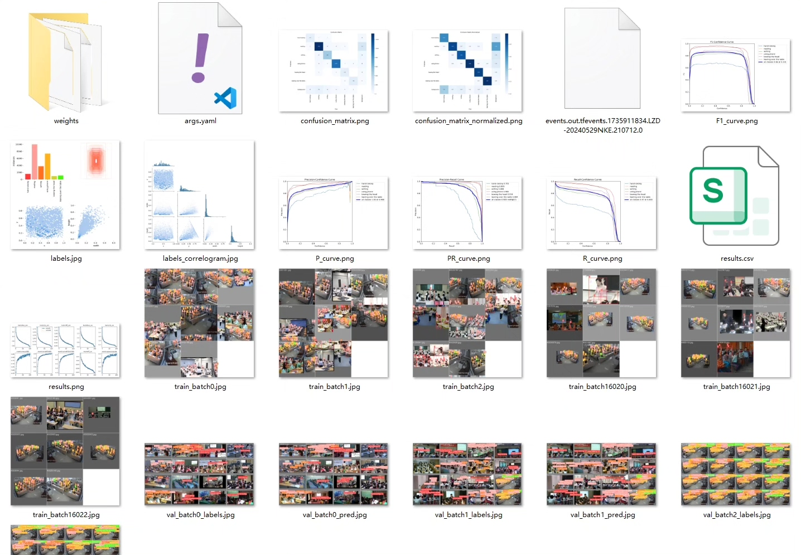
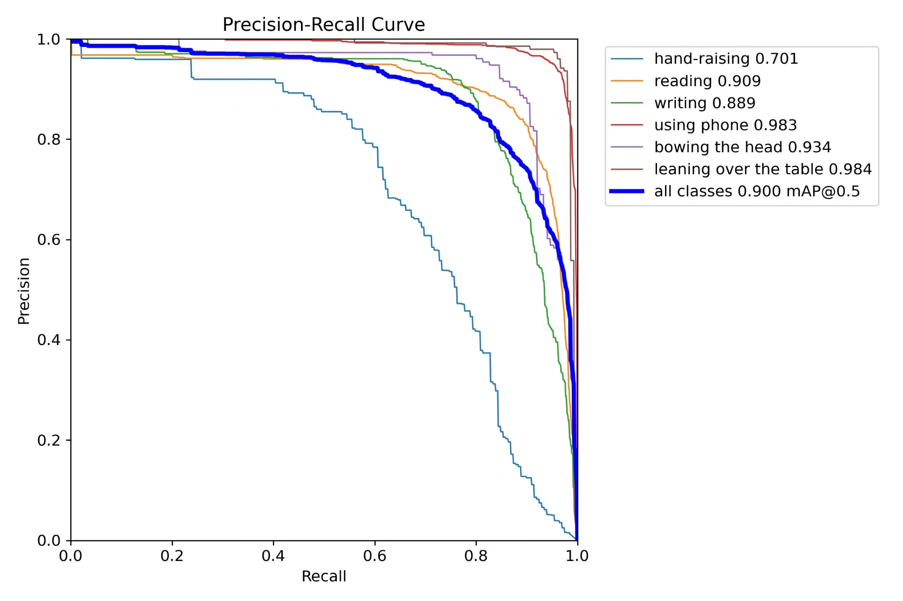
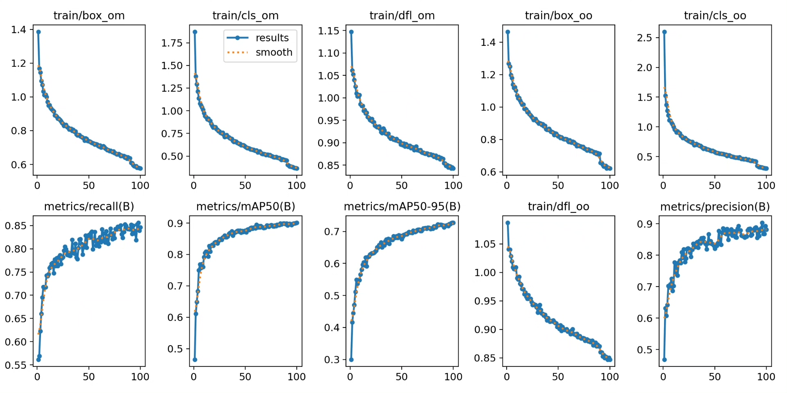
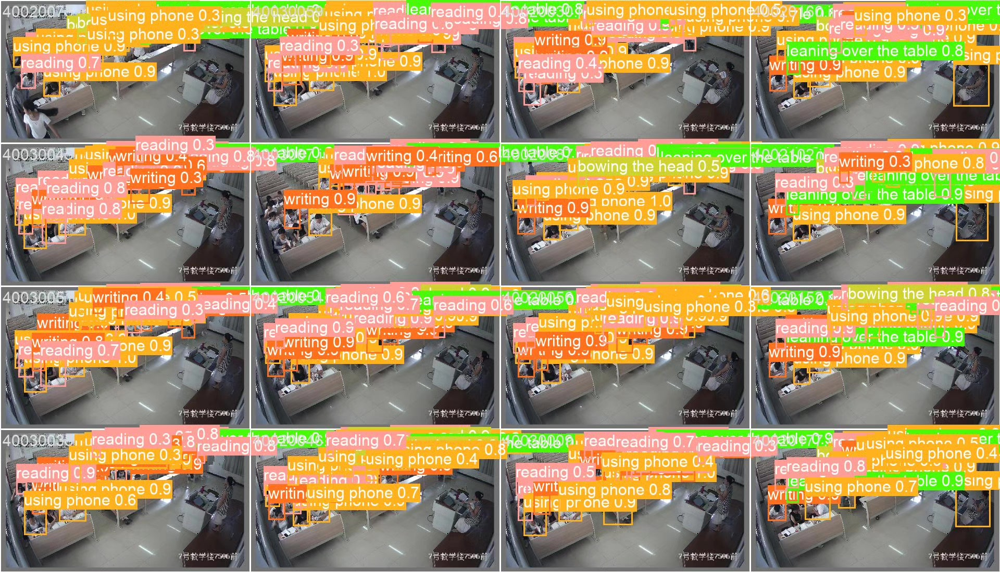
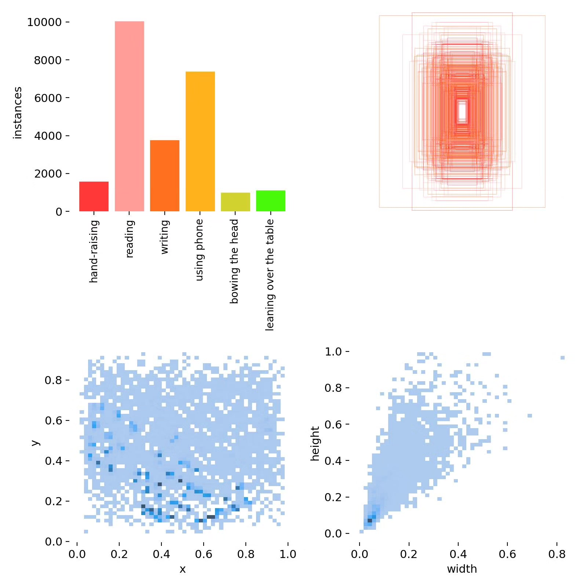
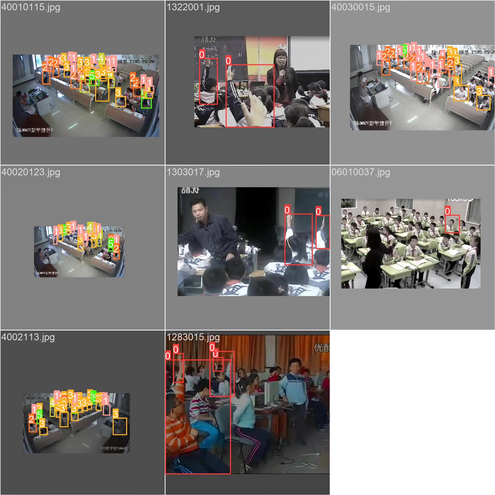

# Based on deep learning YOLOv10, a student classroom behavior detection system for students (YOLOv

## Body

Based on deep learning YOLOv10, a student classroom behavior detection system (YOLOv10+YOLO dataset + UI interface + Python project source code + model)

In the field of intelligent education, the automatic detection and analysis of student classroom behaviors are of great significance for improving teaching quality and evaluating students' learning status. Traditional behavioral detection methods rely on manual observation, which is inefficient and subjective. A computer vision and deep learning-based student behavior detection system can identify students' classroom behaviors in real-time and objectively, providing data support for teachers. This project utilizes the YOLOv10 object detection algorithm to achieve automatic detection of six common classroom behaviors (raised hand, reading, writing, using mobile phone, looking down, lying on desk).

The company's products have obtained the official commercial license certification from YOLO.

We provide after-sales service.

After payment, we will provide WeChat ID for any questions.

Environment configuration: We will provide an instructional tutorial for environment configuration, and WeChat will provide answers to questions.

Remote installation service: If you need remote configuration, an additional fee of 69 is required, with all fees refunded if the configuration fails (only refund installation fees for older computers).

Retraining dataset: After setting up the environment, you can train on your own computer. If you need us to retrain, just pay 69 plus computing power fees (2.5 yuan/hour).

Full after-sales service

## Images

## Payment

Here is a pay link on Stripe ( https://buy.stripe.com/3cs8yP7sY87d0vu9AB ). Please contact me lonlonago@foxmail.com after funding $89, and I will send you a complete data files , thank you!

